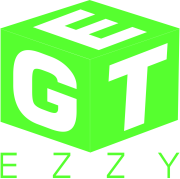

# GetEasy



### Project designed to move item from point A to B easily with auction system

#### [Watch demo video](https://www.youtube.com/watch?v=mQbxmG_1Ezw)

# get started
1. Clone this repo!
```
git clone https://github.com/ismaiilov-atai/GetEasy.gi
```
2. Enter to the folder!
 ```
 cd server
 cd client
 ```
3. Run command for both folders!
```
npm i
```

# Requirements

To be able to run and render google maps, you will need to obtain API key

- [Gooogle Api Key](https://developers.google.com/maps)

# Tech Stack
 - [PostgreSQL](https://www.postgresql.org/) with [sequelize](https://sequelize.org/api/v6/class/src/model.js~model)
   
 - [express](https://expressjs.com)
   
 - [express-sessions](https://www.npmjs.com/package/express-session) for authentication
   
 - [NextJS](https://nextjs.org/)
   
 - [React-google-maps](https://www.npmjs.com/package/@react-google-maps/api)
   

# Feather development

- Offer button which gets created offer for item with id as foreign key
  
- consider picking _state management_ for for refactoring the code
